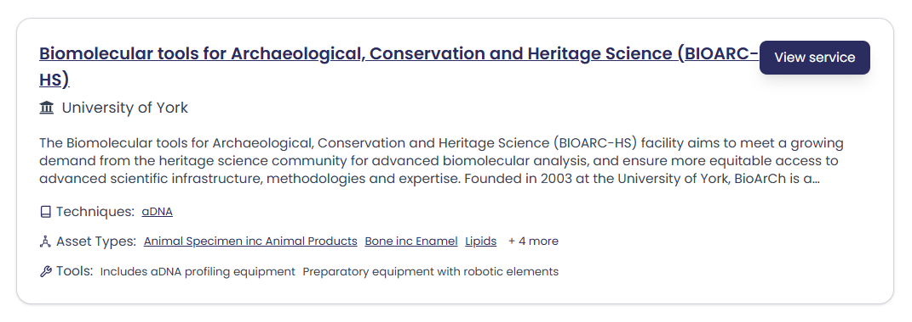
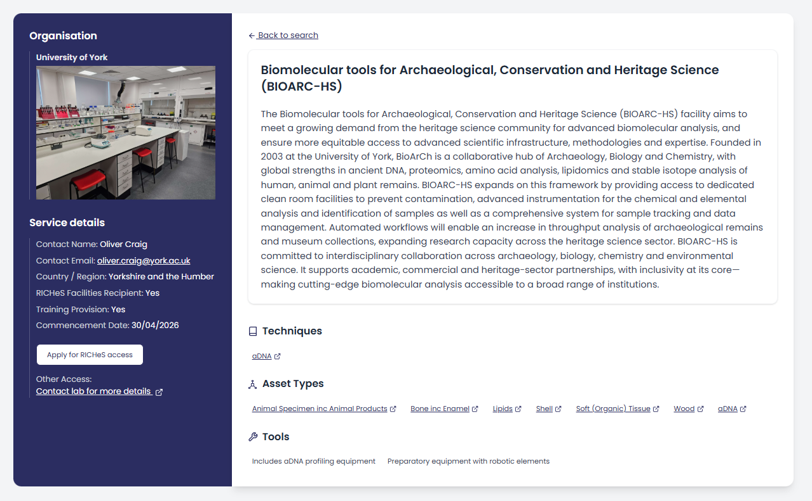

## Search Menu

Use the menu on the left to find services that match your specific needs. The search filters can be used individually or in combination:

* Country/Region - Filter by geographic location within the UK where the service is based
* Organisation - Search by the name of the service provider
* Method/Techniques - Browse available analytical methods, organised by overall technique type and relevant subcategories
* Asset Types - Find services suited to your specific materials or objects

Combine multiple filters to narrow your results and identify the most suitable facilities for your research. Use the 'Reset Filters' button at the bottom to return to the complete service listing.

## Search Results

{ width="850" }

<i>Search results page</i>

Your filtered results display as a list, with each service showing:

* Organisation name and a short description of services
* A list of Techniques, Asset Types and Tools

**Interactive Tags** - Click on any underlined Technique or Asset Type to instantly filter all services offering that capability. This creates a new search result focused on your selected term.

**Vocabulary Links** - Look for controlled vocabulary links on the left of search terms - click on the link to connect to the Getty Art and Architecture Thesaurus for standardised definitions and context.

**Expanding Lists** - When lists show '+ x more', click to view the complete range of techniques, asset types, or tools available from that service.

## Service Page

Click 'View Service' from any search result to see the full details. Each service page provides:

* Organisation details, location, and direct contact person (displayed in the left sidebar for easy reference)
* Service Overview - Comprehensive description of capabilities and services offered
* Technical Specifications
    * Techniques - Complete list of analytical methods available
    * Asset Types - All materials and object types that can be analysed
    * Tools - Inventory of equipment and instruments

This detailed view gives you all the information needed to assess whether a service meets your research requirements and how to get in touch.

{ width="850" }

<i>Service page</i>
