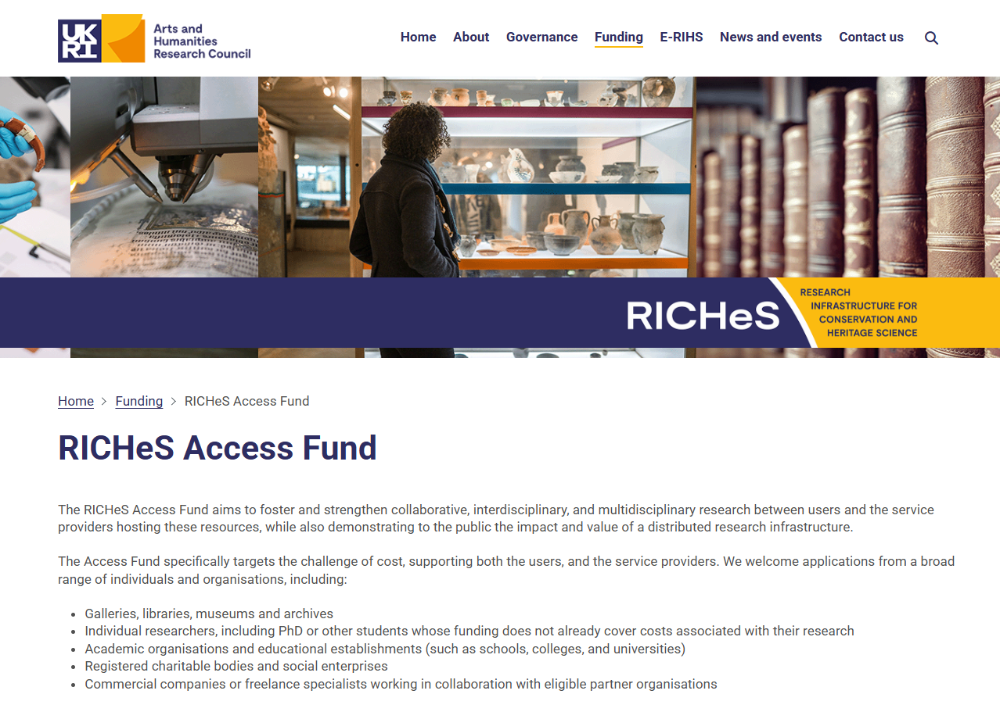

# Apply for RICHeS Access

Within each service page you have the option to click the 'Apply for RICHeS Access' button. This link will allow you to find out more about a scheme that provides funds to support users and the service provider to access these services.

The RICHeS Access Fund aims to foster and strengthen collaborative, interdisciplinary, and multidisciplinary research between users and the service providers hosting these resources, while also demonstrating to the public the impact and value of a distributed research infrastructure.

Applications to the scheme will be open in December. For further information please visit the [RICHeS Access Fund pages](https://www.riches.ukri.org/funding/riches-access-fund/).

{ width="850" }

<i></i>
