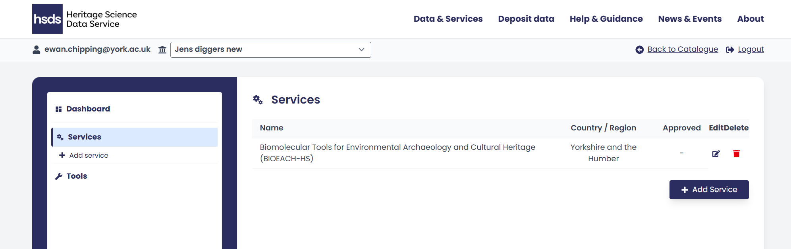

# Introduction

As a service provider you can add a service(s) and edit the information presented to users in the public view of the catalogue. You can choose the information about your service that the heritage science community can discover including how to access your research facilities, what methods you offer, and organisational contacts.

This guide explains how to:

* [Register via the User Management Application (UMA)](./Section-2a.md)
* [Log into the HSDS Catalogue of Services](./Section-2b.md)
* [Navigate and understand the Service Provider dashboard](./Section-2c.md)
* [Create, edit, and publish service entries](./Section-2d.md)

{ width="850" }

<i></i>
