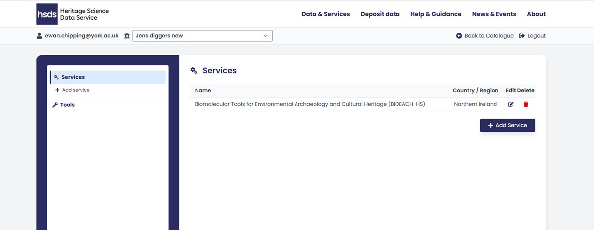

# Introduction

As an organisation you can add a service and change the information presented to users in the public view of the catalogue. You can choose the information about your service the heritage science community can discover, how to access your research facilities, what methods you offer, and organisational contacts.

This guide explains how to:

* [Register via the User Management Application (UMA)](./Section-2a.md)
* [Log in and navigate the HSDS Catalogue of Services](./Section-2b.md)
* [Create, edit, and publish service entries](./Section-2c.md)
* [Manage tools, metadata, and public facing catalogue information](./Section-2c.md)

{ width="850" }

<i></i>
