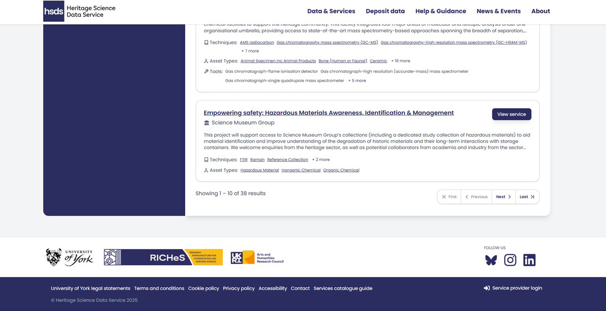

# Log in to the Catalogue of Services

To edit entries in the catalogue, scroll to the bottom of the main catalogue page and select “Service Provider Login”. 

{ width="850" }

<i></i>

Login uses the same credentials (email address/password) as UMA.

If you do not yet have an account with the Catalogue of Services, click the button ‘Register an account with the Archaeology Data Service’ and you will be redirected to UMA.
