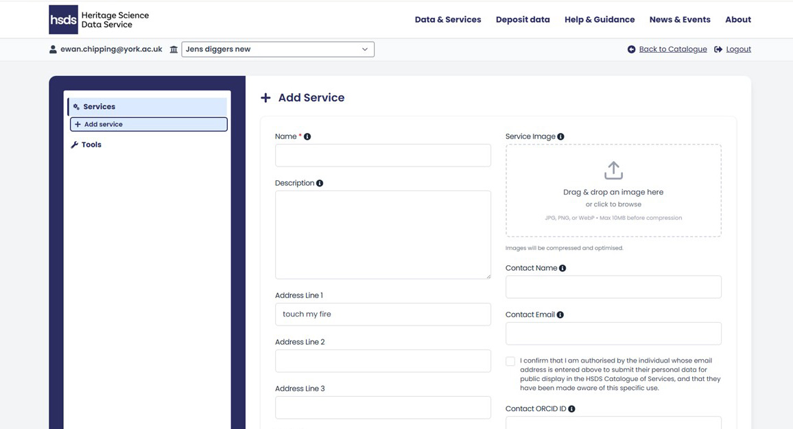
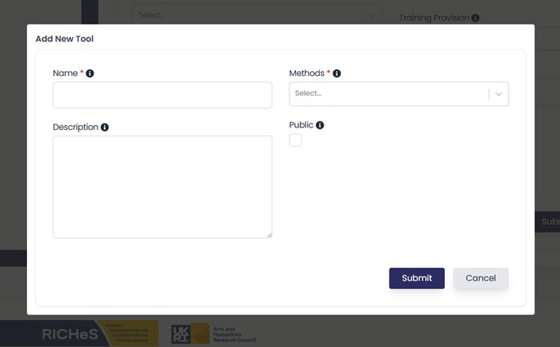

# Creating and Editing Service Entries

Once logged in, the left-hand sidebar shows:

* Services - where you can add or edit your service profile 
* Tools - where you can add the equipment you offer

Most organisations will already see an initial entry imported from UMA. You can edit, delete or add additional services.

{ width="850" }

<i></i>

## Adding and editing a Service

You can change the prepopulated form by clicking edit. This will contain imported organisational information from UMA. Alternatively to start a blank service click “Add Service”.

{ width="850" }

<i></i>

This redirects you to the main edit form. Here you will find a series of information boxes that can be filled in as below. Hovering your mouse over the blue i icon gives you a prompt: 

* Name (the only mandatory field) - should be the service name if different to the organisational name.
* Description - a clear concise free text box with what your service does and key information. This could include research areas and focus.
* Address (auto-filled from UMA but editable) - this can be different from the institutional address.
* Country/Region (used for catalogue filtering) - this is divided by country for Scotland, Northern Ireland, Wales and then England broken into regions. 

Following the contact information are fields about the specifics of the service you are offering. This is divided into several boxes:

**Methods and Techniques** relates to the overarching theme of investigation (methods) further divided into more specific analysis types (techniques). You can choose at the highest level a method from the drop down list and this will select all associated techniques. Alternatively you can click the expand arrow to drop down techniques and choose those that relate to your service only. Selecting multiple is permitted.

**Asset Types** relates to the kinds of materials your service conducts analysis on.  You can click “Infer Asset Types from Techniques” to auto-populate; then edit as needed. Or use the expand arrow to reveal the drop down asset type list and select the relevant fields. 

**Tools/Equipment** relate to the specific items you use to undertake analysis and collect data (e.g. CT scanner, mass spectrometer, camera, microscope). Once you add a tool/equipment it is saved to your profile. If you create new services in the future your tools/equipment will be visible in the drop down. This field is created separately via the add new tool button. 

This opens a pop up where the details of the tool/equipment can be entered as below:

* Tool name - it is recommended you are as specific as possible, this could include what it is or does, the brand and model. 
* Description - concise additional information related to use, including precision, calibration, operational notes. 
Method - which method (as above) the tool/equipment is best associated with.
* Mark “Public” if you are ready for the tool to appear in the catalogue.

{ width="450" }

<i></i>

You can add a **Service Image** representing your service or facility. This can be any image that best represents your service, such as a logo, picture of the facility, or PI/contact person. Accepted file types are; .jpg or .jpeg, .png, .webp. The maximum file size of the image is 10MB. 

## Contact information

The following fields contains details for the service main contact, including **Contact name** (which can be left blank if the contact goes to a help desk or shared central contact), and **Email address**, which can be either personal or a shared email address. There is also the option to add an **ORCID**, a persistent identifier for the relevant person listed as the contact. Ensure contact staff approve their details appearing publicly, there is an authorisation check box to confirm consent has been given. You also have the option to add an external URL to link to any service web pages. 

You can select the type of **RICHeS funding** the service received by clicking the drop down. This can either be none, facility or collection. 

There is the option to add if you **Provide training** in your tools/techniques, or if attendees are expected to already have the knowledge on how to use equipment. 

The final field is the **Commencement date**, namely the date the service went live. This can be a date in the future, if your service is currently being set up.

## Previewing and publishing your service entry

At the end of the form is a check box to **Make the service public**. Unchecked your service will not appear in the main catalogue as visible to all users. However, as a service provider members of your organisation (when logged in) can view your entry as a draft. This will be shown alongside other services in the public catalogue but it will be greyed out. 

To preview:

1. Return to the Catalogue
2. Scroll to find your service (greyed out, marked "Not Public")
3. Click it to view the public view layout

{ width="850" }

<i></i>

Checking the public box will launch your service as live. Users will then be able to see all information. 

The submit button will save your service profile. This can be done with the public box checked or blank, as explained above. 

## Multiple services witin one organisation

Organisations with several laboratories, facilities, or specialist services may create as many service entries as necessary and edit their entries by repeating this process. 

If your organisation has multiple services each service can:

* Have its own tools
* Can have distinct contacts and addresses
* Can be published or hidden independently