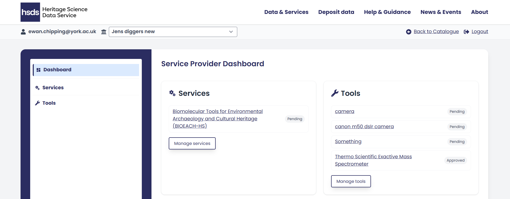
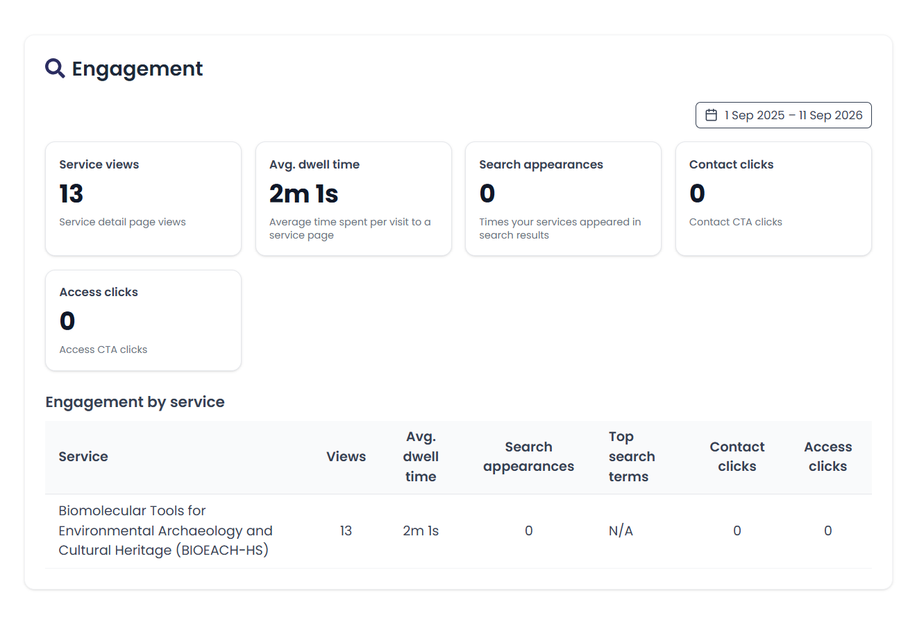
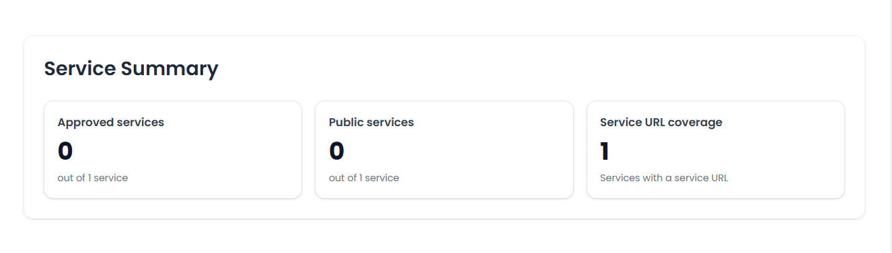

Once logged in you are directed to the Service Provider Dashboard. This dashboard displays the key metrics for each of your services.  

At the top on the left of the dashboard are the Services you currently offer. If it’s your first time logging in, this will be empty. On the right is a list of the tools you have submitted. If you have not yet submitted any tools this list will also be empty. 

To edit services or tools either click the hyperlinked name or the ‘Manage’ button under each service or tool. 

The grey text to the right of both services and tools shows their approval status: 

- ‘Pending’  (is awaiting verification from the HSDS) or 
- ‘Approved’. 

{ width="850" }

<i></i>

**Engagement**  
This section shows a breakdown of key engagement metrics related to your services. 

The boxes at the top show metric for all services you offer combined and include; 

* __Service views__ - the number of service views,   
* __Average dwell time__ - the average time spent per visit to a service page,   
* __Search appearances__ - the number of times your services appeared in search results,   
* __Contact clicks__ - the number of times services contact information was clicked, and   
* __Access clicks__ - the number of times services access information was clicked. 

These engagement statistics are also divided by each of the services that you offer to provide more granular detail. 

{ width="850" }

<i></i>

**Service summary**   
The service summary section provides top level information for your service(s) as a whole. 

- __Approved services__ - how many of your submitted services have been verified by the HSDS.
- __Public services__ - how many of your services you have made available for users to discover in the public facing catalogue. 
- __Service URL coverage__ - how many services you have added a link into the ‘Service URL’ field in the edit service form. 

{ width="850" }

<i></i>

