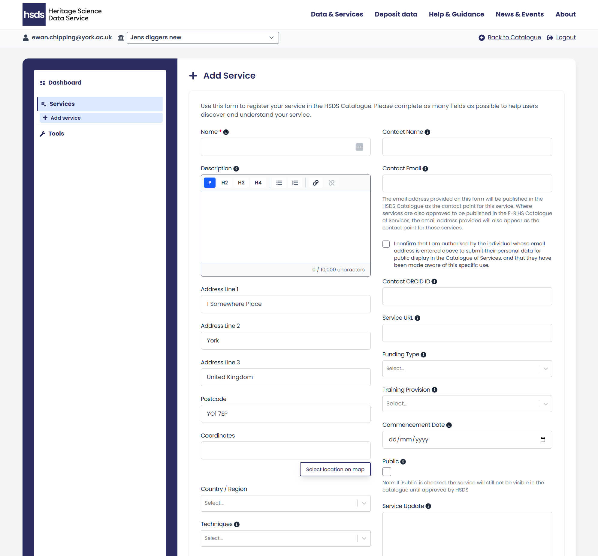
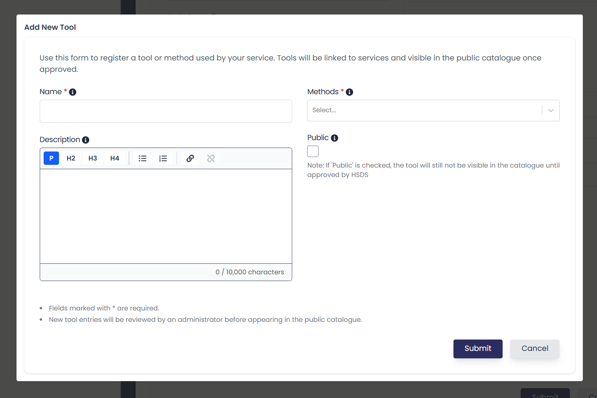
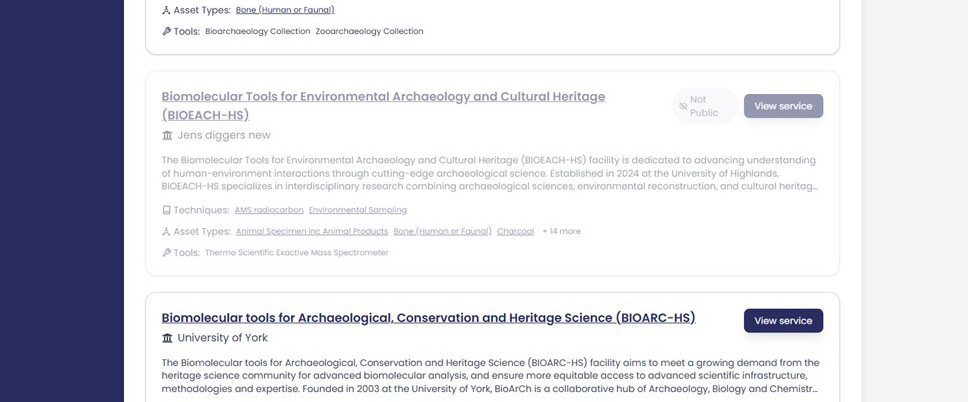

# Creating and Editing Service Entries

Once logged in, you can create and edit a service in multiple ways. The left-hand sidebar shows three navigation options:

* Dashboard - where you can view your services and tools, and see engagement statistics
* Services - where you can add or edit your service profile 
* Tools - where you can add the equipment you offer

Clicking __Services__ take you to a page that lists all your services and where you can add or edit your service profile.

Clicking __Tools__ will take you to a page where you can add or edit information about the equipment you offer.

{ width="850" }

<i></i>

## Add Service Form

To start creating and editing service entries, first navigate to the Services page. You can edit or delete any existing entries using the buttons at the right hand side of your listed entry. 

Add a new service by clicking the '+ Add Service' button. This will open up a new form containing a series of information boxes. Hovering your mouse over the blue 'i' icon provides additional information.

{ width="850" }

<i></i>

A full list of the fields and the information that should be provided for each service is listed below:

## Service Information

* __Name__ - The service name if different to the organisational name (this is the only mandatory field). This is the name that will appear in the catalogue.
* __Description__ - A clear and concise description of your service offers. This information will be displayed on the main service page. You can change the displayed text using the editor tool bar at the top of this field. There are four text options (paragraph, heading 2, 3 and 4). There is also an ‘add link’ button to embed links in text. The text box has a 10,000 character limit. 
* __Address__ - The full address of your service including postcode.
* __Coordinates__ - The coordinates for the location of your service (in British National Grid Reference). You can also manually select the location on a map by clicking on the button 'Select location on map'.
* __Country/Region__ - Choose the region of the UK in which your service is located.

You can also add an Image representing your service or facility. This can be any image that best represents your service, such as a logo or a picture of the facility. Accepted file types are; JPG, PNG or WebP. The maximum file size of the image is 10MB.

## Techniques, Asset Types and Tools

__Techniques__ relate to the investigation types offered by your service. Techniques are further divided into more specific analysis types. Please select all techniques that are offered by your service.

You can select each technique in the drop down list, which will also select all the specific analysis types that fall under that general investigation type. Alternatively, click the expand arrow to view the specific analysis types and choose only those that relate to your service. Selecting multiple techniques is permitted.

__Asset Types__ relates to the kinds of materials your service conducts analysis on. Please select all Asset Types that can be analysed by your service. You can click 'Infer Asset Types from Techniques' to auto-populate this field based on the techniques selected above. The results of this search can then be edited as needed.

__Tools__ relate to the specific items that your service uses to undertake analysis and collect data (e.g. CT scanner, mass spectrometer, camera, microscope). This field is populated by clicking the 'Add New Tool' button. This will open a pop up menu where the details of the tool can be entered as below:

* Name - Please provide the full name of the tool. It is recommended you are as specific as possible. This should ideally follow the format of brand and model and what it is or does (for example; Canon R5 DSLR camera, Bruker Skyscan 1276 Micro CT).  
* Description - Please provide a concise description about the tool such as information related to use, including precision, calibration, operational notes.  
* Method - Please select which method (as above) the tool is best associated with. You can select multiple entries in this menu.  
* Public - Mark as 'Public' if you are ready for the tool to appear in the catalogue. The tool will not be visible in the catalogue until approved by the HSDS.

Once you add a tool/equipment it will be saved to your profile. If you create new services in the future your tools/equipment will be visible in the drop down.

{ width="650" }

<i></i>

## Contact information

The following fields provide details for the main contact of your service:

- __Contact name__ - This can be left blank if the contact goes to a help desk or shared central contact.
- __Email address__ - This can be either a personal or shared email address. 
- __ORCID__ - This is a persistent identifier for the relevant person listed as the contact, if applicable.
- __Service URL__ - You can also add an external URL to link to any service web pages.

Please ensure contact staff approve their details appearing publicly. There is an authorisation check box to confirm consent has been given.

## Additional Information

__Funding Type__ - Select the type of funding the service has received by clicking the drop down menu. The options are either RICHeS Facility, RICHeS Collection or CapCo/CReSCa.

__Commencement Date__ - List the date the service went live. This can be a date in the future, if your service is currently being set up.

__Training Provision__ - Select whether your Service provides training in your tools/techniques.

__Public__ - Check the box to make your service publicly available (once approved by the HSDS). Leaving the checkbox blank means only people in your organisation who can edit the service profile will see your service displayed in the catalogue.

__Service Update__ - This is a free text box that can be used to make potential users aware of temporary additional information, such as down time, equipment availability, etc. The style of the service update can be controlled vto highlight it as either green (positive) or red (negative). The expiry of this can also be set to automatically resolve. 

## Previewing and publishing your service entry

At the end of the form is a check box to **Make the service public**. Unchecked your service will not appear in the main catalogue as visible to all users. However, as a service provider members of your organisation (when logged in) can view your entry as a draft. This will be shown alongside other services in the public catalogue but it will be greyed out. 

To preview:

1. Return to the Catalogue
2. Scroll to find your service (greyed out, marked "Not Public")
3. Click it to view the public view layout

{ width="850" }

<i></i>

Checking the public box will launch your service as live. Users will then be able to see all information. 

The submit button will save your service profile. This can be done with the public box checked or blank, as explained above. 

## Multiple services within one organisation

Organisations with several laboratories, facilities, or specialist services may create as many service entries as necessary and edit their entries by repeating this process. 

If your organisation has multiple services each service can:

* Have its own tools
* Can have distinct contacts and addresses
* Can be published or hidden independently