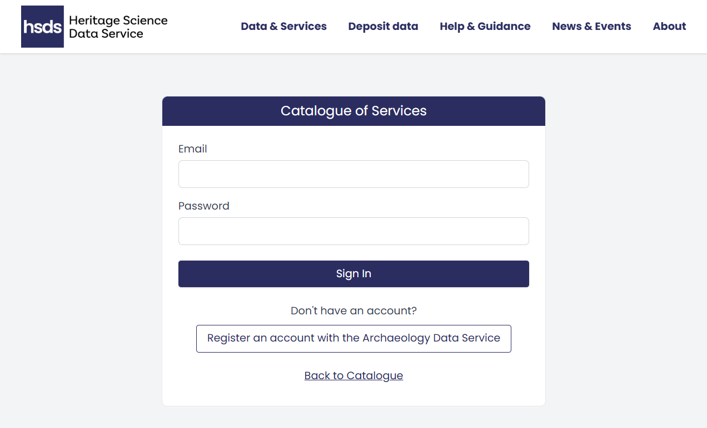
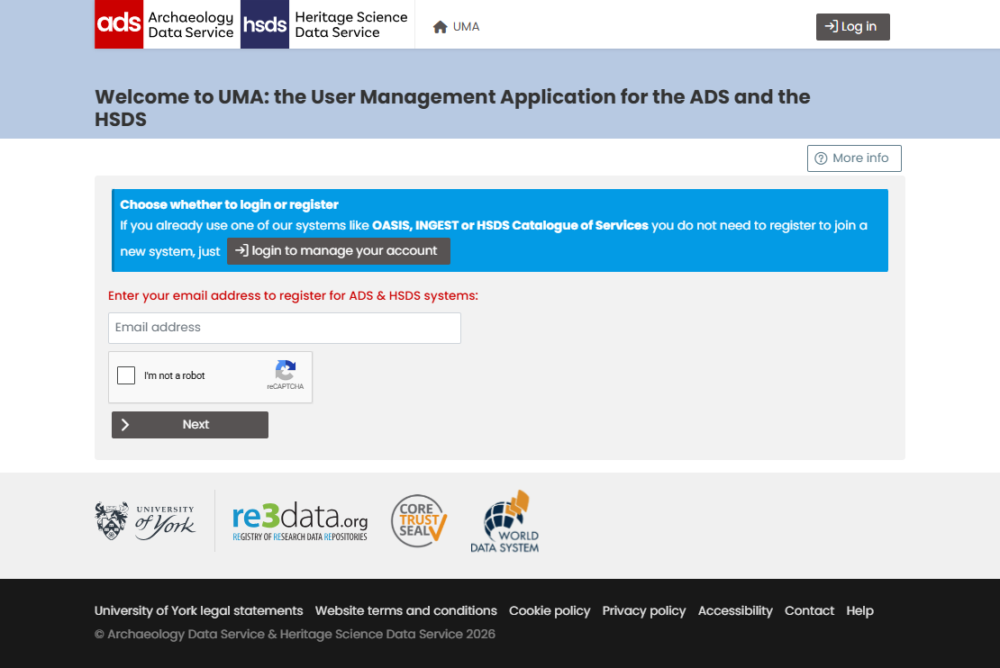

# How to Register via the User Management Application (UMA)

To use the Service Provider menu, you will first need to register via the [User Management Application](https://archaeologydataservice.ac.uk/uma/index.xhtml) (UMA). If you do not already have an account, click the 'Register an account with the Archaeology Data Service' button on the [Service Provider login page](https://hsds.ac.uk/services-catalogue/login). 

{ width="850" }

<i></i>

## User Management Application (UMA)

UMA is a centralised platform for managing user accounts and access permissions across ADS and HSDS services. You can use UMA to manage your own personal data and, if an Admin user, manage users for your organisation.

{ width="850" }

<i></i>

To register, enter your email address and complete the reCAPTCHA verification. Then enter your details, including a password. You can also add (or create) an [ORCID](https://orcid.org/). You will need to accept the Terms and Conditions and privacy policy and press "save details". After submitting your registration, you'll receive a verification email. Check your inbox and click the verification link to activate your account.

!!! note "**Registration**"

    If you register as part of an organisation, you may need to wait for approval from your organisation's admin user before you can login via the Service Provider login page.

-----

Full guidance for this can be found on the [UMA help pages](https://archaeologydataservice.ac.uk/uma/help.xhtml#register).  