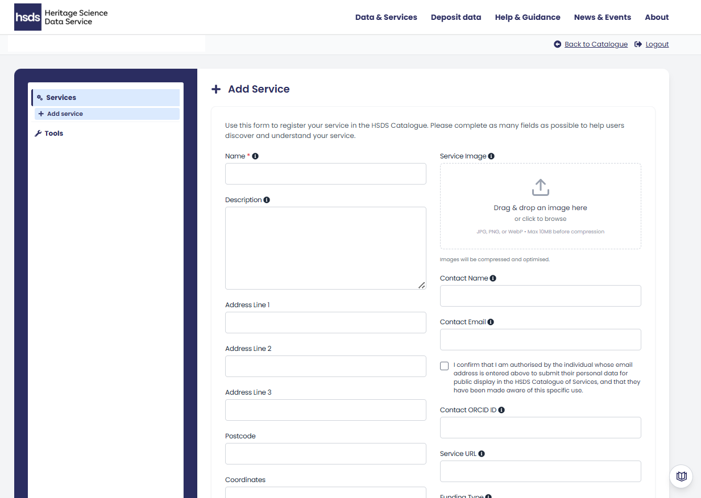

# Creating and Editing Service Entries

Once logged in, the left-hand sidebar shows two options:

* Services - where you can add or edit your service profile.
* Tools - where you can or edit information about the equipment you offer.

You can edit or delete any existing entries using the buttons at the right hand side of your listed entry. You can add new services by clicking the '+ Add Service' button.

{ width="850" }

<i></i>

## Adding a Service

To start a new service entry click '+ Add Service' button.

This will open up a new form containing a series of information boxes. Hovering your mouse over the blue 'i' icon provides additional information. 

{ width="850" }

<i></i>

A full list of the fields and the information that should be provided in each is listed below:

### Contact Information

* __Name__ - The service name if different to the organisational name. This is the only mandatory field.
* __Description__ - A clear and description of your service offers. This information will be displayed on the main service page.
* __Address__ - The full address of your service including postcode.
* __Coordinates__ - The coordinates for the location of your service (in British National Grid Reference). You can also manually select the location on a map by clicking on the button 'Select location on map'.
* __Country/Region__ - Choose the region of the UK in which your service is located.

You can add a **Service Image** representing your service or facility. This can be any image that best represents your service, such as a logo or a picture of the facility. Accepted file types are; JPG, PNG or WebP. The maximum file size of the image is 10MB. 

### Techniques, Asset Types and Tools

**Techniques** relate to the investigation types offered by your service, which are then further divided into more specific analysis types. Please select all techniques that are offered by your service.

You can select each technique in the drop down list. This will also select all the specific    analysis types that fall under that general investigation type. 

Alternatively, click the expand arrow to view the specific analysis types and choose only those that relate to your service. Selecting multiple techniques is permitted.

**Asset Types** relates to the kinds of materials your service conducts analysis on. Please select all Asset Types that can be analysed by your service.

You can click 'Infer Asset Types from Techniques' to auto-populate this field based on the techniques selected above. The results of this search can then edit as needed. 

**Tools/Equipment** relate to the specific items that your service uses to undertake analysis and collect data (e.g. CT scanner, mass spectrometer, camera, microscope). This field is populated by clicking the 'Add New Tool' button. This will open a pop up menu where the details of the tool/equipment can be entered as below:

* *Tool name* - Please provide the full name of the tool. It is recommended you are as specific as possible. This could include what it is or does, the brand and model. 
* *Description* - Please provide a concise description about the tool such as information related to use, including precision, calibration, operational notes. 
* *Method* - Please select which method (as above) the tool is best associated with. You can select multiple entries in this menu.
* *Public* - Mark as 'Public' if you are ready for the tool to appear in the catalogue. The tool not be visible in the catalogue until approved by the HSDS.

{ width="450" }

<i></i>

Once you add a tool/equipment it will be saved to your profile. If you create new services in the future your tools/equipment will be visible in the drop down. 

## Contact information

The following fields provide details for the main contact of your service:

* **Contact name** - This can be left blank if the contact goes to a help desk or shared central contact
* **Email address** - This can be either a personal or shared email address.
**ORCID** - This is a persistent identifier for the relevant person listed as the contact, if applicable. 
* **Service URL** - You can also add an external URL to link to any service web pages. 

Please ensure contact staff approve their details appearing publicly. There is an authorisation check box to confirm consent has been given. 

### Additional Information.

You can select the type of **RICHeS funding** the service has received by clicking the drop down. The options are either *RICHeS Facility*, *RICHeS Collection* or *CapCo/CReSCa*. 

There is also an option to add if you **Provide training** in your tools/techniques.

**Commencement date** lists the date the service went live. This can be a date in the future, if your service is currently being set up.

!!! note "**New entries**"

    Please note new service entries will be reviewed by an administrator before appearing in the public catalogue.

-----

## Editing an existing Service

Once you have submitted an entry, it will now appear the Services menu. 

To edit an existing entry, click on the edit button to the right of the service name. This will reopen the '+ Add Service' menu, as described above. Each field can then be amended separately.